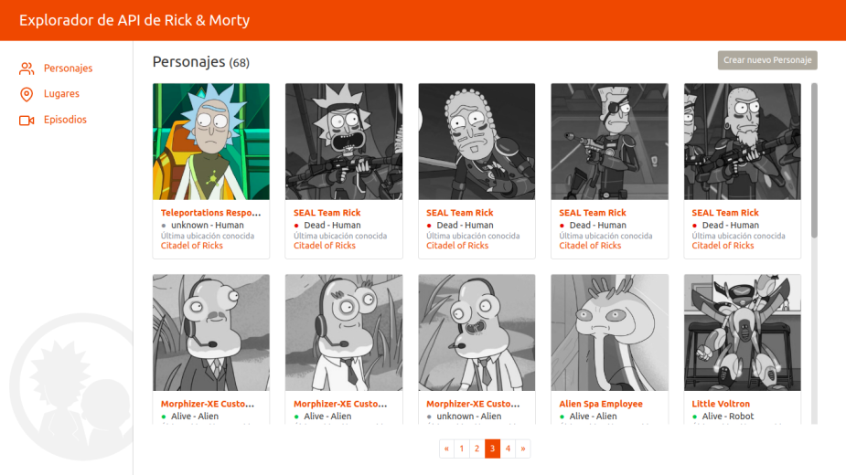
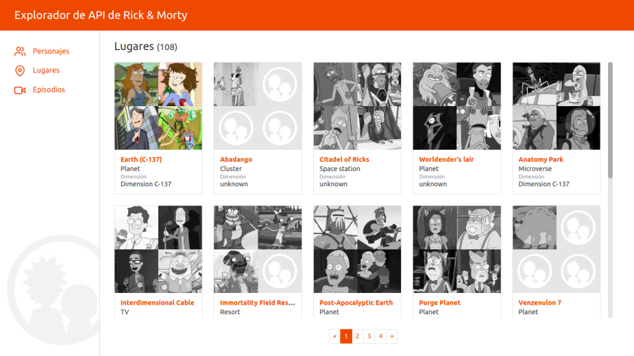
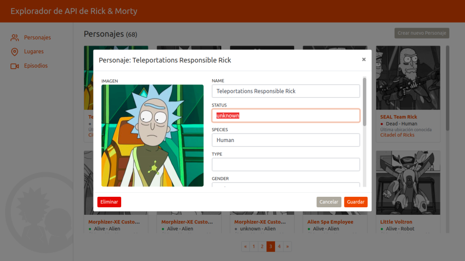
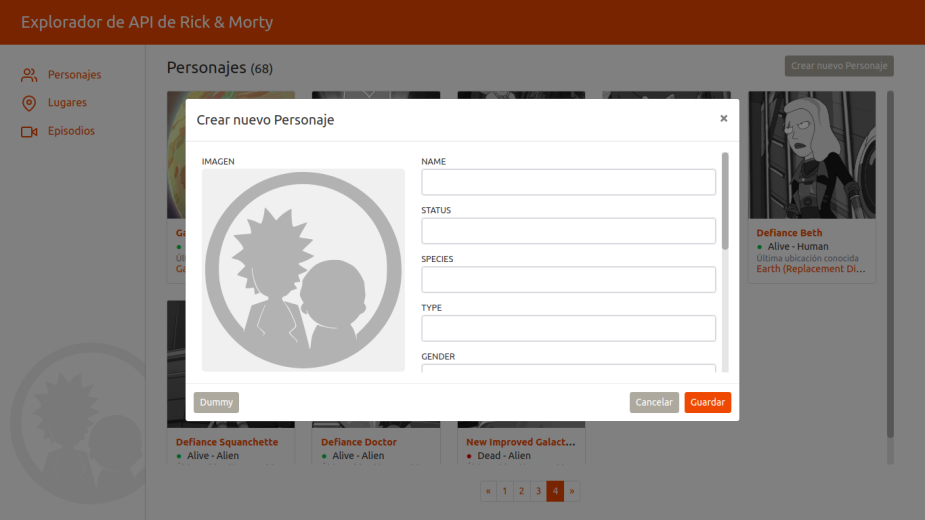
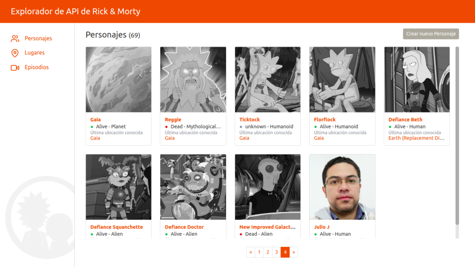
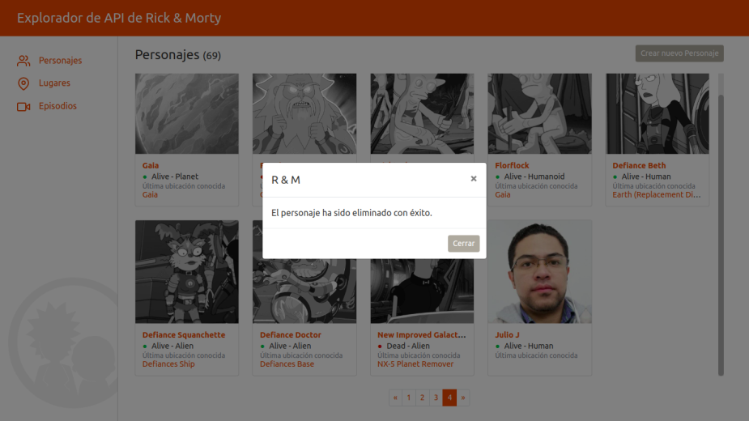
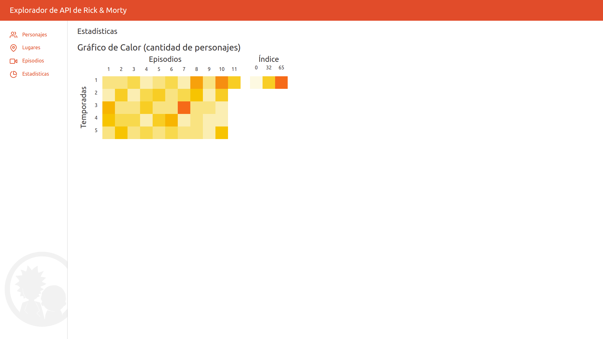

# Modificación (Página de estadísticas - mapa de calor) - Explorador de API de Rick & Morty

Esta aplicación representa la solución a la evaluación técnica de desarrollador frontend en Datatraffic.

Se agrego una página de estadísticas donde se muestra un mapa de calor para la cantidad de personajes por temporadas y episodios.

# INSTALACION

## CLONAR REPOSITORIO

-   git clone \*Acceso al repositorio (ej: git@github.com:srm-99/rick-morty.git)
-   cd rick-morty

## INSTALAR DEPENDENCIAS

### FRONTEND

    -   cd ./client
    -   npm install

### BACKEND

    -   cd ./server
    -   npm install

## EJECUCION

### FRONTEND

    -   cd ./client
    -   npm run start:dev (proyecto corre en localhost:3000)

### BACKEND

    -   cd ./server
    -   npm run start:dev

## COMPILACIÓN FRONTEND

-   Para compilar React (cuando sea modificado) ejecutar
    npm run build en ./client

## CAPTURAS

## AUTOR

-   Julio J. Yépez (@jjyepez)

## HISTORIAL DE ACTUALIZACIONES

03/03/2021

por @jjyepez

23/12/2021

POR @srm-99
